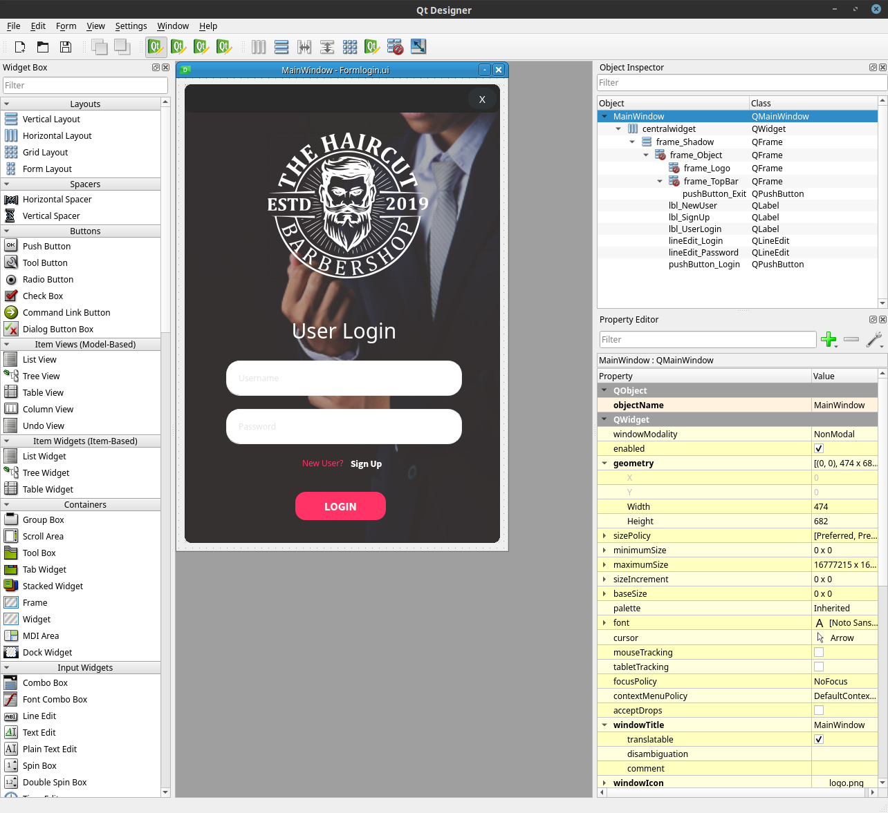
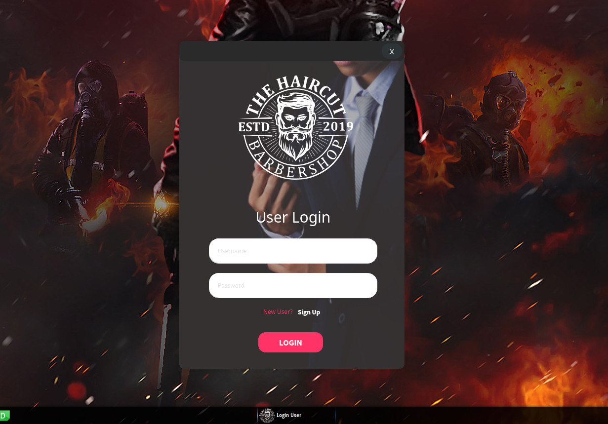

# LOGIN BARBER SHOP
👨‍🏫APENAS INTERFACE DE LOGIN COM PYSIDE.

 <br>
 <br>

## DESCRIÇÃO:
Este projeto cria uma aplicação de login de usuário usando PySide2 (Qt for Python). Aqui está uma descrição detalhada das funcionalidades:

1. **Interface de Usuário Moderna:**
   - A aplicação apresenta uma interface gráfica moderna e responsiva, criada usando PySide2 e Qt Designer. Ela é estilizada sem a barra de título padrão, proporcionando um visual limpo e contemporâneo.

2. **Autenticação de Usuário:**
   - O aplicativo permite que os usuários insiram seus nomes de usuário e senhas em campos dedicados. O campo de senha tem sua entrada oculta para segurança.

3. **Funcionalidade de Login:**
   - Embora ainda não implementada no código fornecido, a estrutura está configurada para aceitar e processar credenciais de login. A funcionalidade de login pode ser expandida para incluir autenticação com banco de dados ou outros métodos de validação.

4. **Interação com Elementos Gráficos:**
   - Os botões de login e fechar são interativos e responsivos ao clique do usuário. O botão de fechar permite encerrar a aplicação, enquanto o de login está pronto para ser programado para validar e processar as credenciais do usuário.

5. **Customização Visual:**
   - O aplicativo utiliza efeitos visuais como sombra dinâmica (`QGraphicsDropShadowEffect`) para destacar o formulário de login, melhorando a estética e a usabilidade geral da interface.

6. **Capacidade de Movimentação da Janela:**
   - Os usuários podem arrastar a janela de login movendo o mouse sobre a barra superior, o que é implementado para proporcionar uma experiência de usuário fluida.

## EXECUTANDO O PROJETO: 
1. **Instalação:**
   Certifique-se de ter Pyside2 instalado:

   ```bash
   pip install PySide2
   ```

2. **Iniciando o APP:**
   - Entre no diretório `CODIGO` e execute com o comando:
   ```bash
   python CODIGO.py
   ```

3. **Interagindo com o Aplicativo**:
   - Insira um nome de usuário e senha nos campos correspondentes.
   - Clique no botão "LOGIN" para proceder com a autenticação (a funcionalidade real de login deve ser implementada no método `click_login`).

## NÃO SABE?
- Entendemos que para manipular arquivos em muitas linguagens e tecnologias, é necessário possuir conhecimento nessas áreas. Para auxiliar nesse aprendizado, oferecemos cursos gratuitos disponíveis:
* [CURSO DE PYTHON](https://github.com/VILHALVA/CURSO-DE-PYTHON)
* [CURSO DE PYSIDE](https://github.com/VILHALVA/CURSO-DE-PYSIDE)
* [CONFIRA MAIS CURSOS](https://github.com/VILHALVA?tab=repositories&q=+topic:CURSO)

## CREDITOS:
- [PROJETO CRIADO PELO "MrCl0wnLab"](https://github.com/MrCl0wnLab/Python_PySide2_LoginBarberShop)
- [PROJETO EDITADO PELO VILHALVA](https://github.com/VILHALVA)
